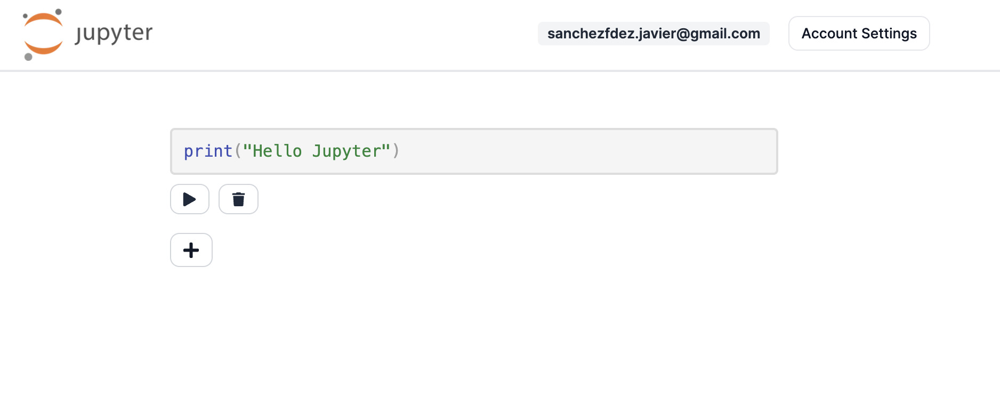

# Jupyter Notebook Clone




Play with it [here](https://jupyter.javisf.com/)!

## Local development

First, run the development server:

```bash
npm run dev
# or
yarn dev
# or
pnpm dev
```

Open [http://localhost:3000](http://localhost:3000) with your browser to see the result.
